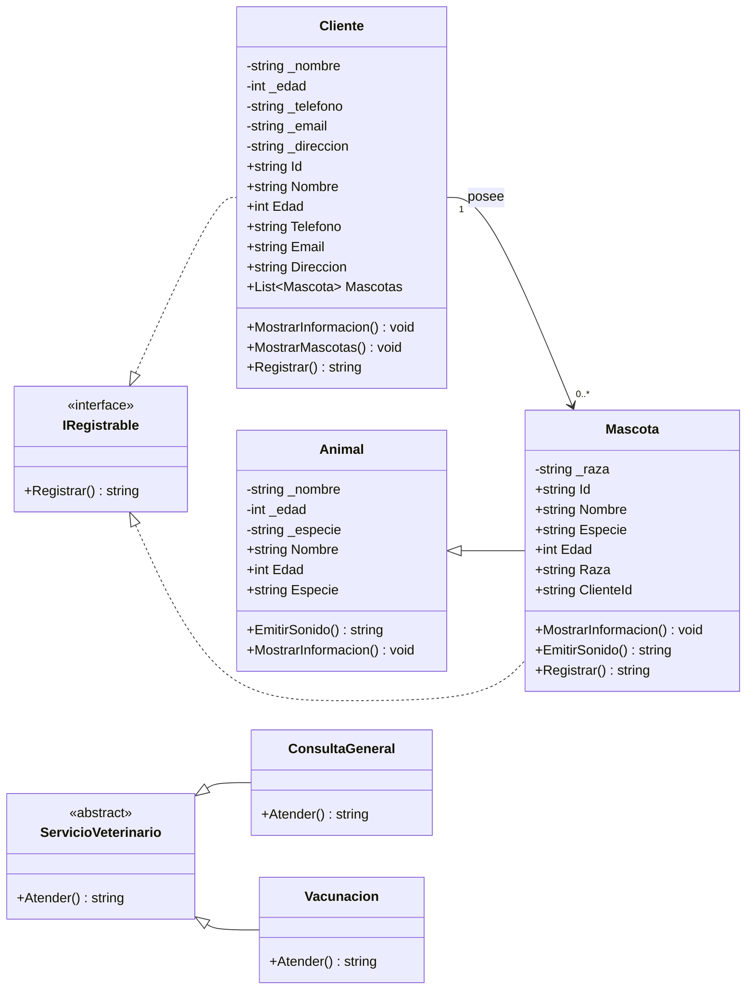

# Diagrama UML - Clínica Veterinaria ZeusPet

En una clínica veterinaria el **paciente es la mascota** (la que se atiende) y el
**Cliente es el dueño**. Un dueño puede tener una o varias mascotas.

## Relaciones

- **Asociación (dueño → mascota):** un `Cliente` posee de 0 a muchas `Mascota`
  (lista `List<Mascota>`). La mascota guarda la referencia al dueño mediante `ClienteId`.
- **Herencia:** `Mascota` hereda de `Animal` (nombre, edad, especie) y agrega
  `Raza`, `Id` y `ClienteId`.
- **Abstracción:** `ServicioVeterinario` es abstracta; `ConsultaGeneral` y
  `Vacunacion` sobrescriben `Atender()`.
- **Interfaz:** `IRegistrable` con `Registrar()` la implementan `Cliente` y `Mascota`.
